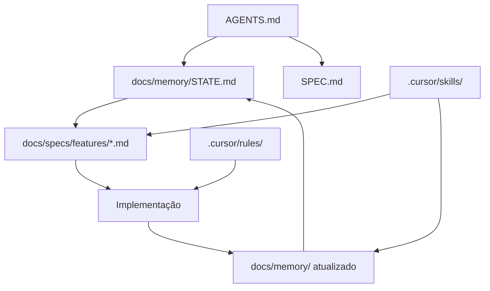

# Guia — Spec Driven Development com Cursor (Elendra)

> Guia de referência para desenvolvimento assistido por IA neste projeto.
> Criado: 2026-06-18

## Arquitetura IA



## O que foi configurado

### Regras Cursor (`.cursor/rules/`)

| Regra | Quando aplica |
|-------|---------------|
| `spec-driven.mdc` | Sempre — workflow SDD |
| `elendra-core.mdc` | Sempre — stack e convenções |
| `memory-evolution.mdc` | Sempre — quando atualizar memória |
| `client-react.mdc` | Arquivos `client/**` |
| `server-express.mdc` | Arquivos `server/**` |
| `specs-files.mdc` | Arquivos `docs/specs/**` |

### Skills (`.cursor/skills/`)

| Skill | Uso |
|-------|-----|
| `spec-driven-dev` | Criar specs antes de codar |
| `update-memory` | Atualizar memória após feature |
| `jsmyadmin` | Conhecimento de domínio (formato Cursor nativo) |

### Memória evolutiva (`docs/memory/`)

| Arquivo | Conteúdo |
|---------|----------|
| `STATE.md` | O que existe hoje (mapeado do código real) |
| `PATTERNS.md` | Padrões reutilizáveis do projeto |
| `DECISIONS.md` | ADRs — decisões de arquitetura |

### Specs (`docs/specs/`)

| Recurso | Caminho |
|---------|---------|
| Template de feature | `.cursor/skills/spec-driven-dev/feature-spec-template.md` |
| Specs incrementais | `docs/specs/features/*.md` |
| README do fluxo | `docs/specs/README.md` |

### Entry points

| Arquivo | Função |
|---------|--------|
| `AGENTS.md` | Ponto de entrada para o Cursor Agent |
| `.cursor/README.md` | Guia da config Cursor |
| `docs/README.md` | Índice da documentação |

---

## Como usar no dia a dia

### Nova feature

```
Use spec-driven-dev skill. Criar spec para [descrição da feature].
```

Depois de aprovar a spec:

```
Implementar docs/specs/features/[nome].md. Atualizar memória ao terminar.
```

### Bug fix simples

Corrigir direto no código. Se o comportamento mudar → invocar skill `update-memory`.

### Refatoração

Se afetar mais de 3 arquivos → criar spec antes. Consultar `docs/memory/DECISIONS.md` para constraints.

---

## Ciclo de memória

```
Feature → spec → código → STATE.md + PATTERNS.md + DECISIONS.md
```

Cada sessão Cursor começa com contexto preciso, sem re-explicar o projeto.

### Quando atualizar cada arquivo

| Trigger | Atualizar |
|---------|-----------|
| Feature concluída | `STATE.md` + status da spec |
| Padrão recorrente | `PATTERNS.md` |
| Decisão arquitetural | `DECISIONS.md` |
| Spec diverge do código | Corrigir spec ou código, depois `STATE.md` |
| Feature removida | Marcar `deprecated` na spec + STATE |

---

## Hierarquia de documentos

| Arquivo | Papel |
|---------|-------|
| `SPEC.md` | Visão do produto, arquitetura alvo |
| `docs/specs/features/*.md` | Unidades incrementais de trabalho |
| `docs/memory/STATE.md` | Verdade do que está implementado |
| `AGENTS.md` | Mapa rápido para IA |
| `.cursor/rules/` | Como trabalhar (workflow, convenções) |
| `.cursor/skills/` | Procedimentos passo a passo |

---

## Status de uma feature spec

```
draft → approved → in-progress → implemented → deprecated
```

- **draft** — em escrita, não implementar ainda
- **approved** — pronta para implementação
- **in-progress** — desenvolvimento ativo
- **implemented** — concluída, STATE.md atualizado
- **deprecated** — substituída, não implementar

---

## Evoluir regras ao longo do projeto

1. Padrão se repete 3+ vezes → adicionar em `docs/memory/PATTERNS.md`
2. Afeta todas as sessões → considerar nova rule em `.cursor/rules/`
3. Manter rules com menos de 50 linhas, uma preocupação por arquivo
4. Após cada feature mergeada → skill `update-memory`

---

## Prompts prontos

**Iniciar feature nova:**
```
Read AGENTS.md e docs/memory/STATE.md.
Use spec-driven-dev skill para criar spec de [feature].
```

**Implementar spec aprovada:**
```
Implementar docs/specs/features/[nome].md seguindo .cursor/rules/.
Atualizar memória ao terminar.
```

**Registrar decisão:**
```
Use update-memory skill. Registrar ADR para [decisão].
```

---

## Stack (referência rápida)

- **Client:** React 18, TS, shadcn/ui, Tailwind, Zustand, Socket.io, Axios — `:5173`
- **Server:** Express, TS, mysql2/pg/mariadb, Multer, Socket.io, JWT — `:3000`
- **Monorepo:** npm workspaces (`client/`, `server/`)

```bash
npm run dev          # client + server
npm run dev:client   # :5173
npm run dev:server   # :3000
npm run build
```

---

## Próximo passo sugerido

Para validar o fluxo completo, pedir:

> "Use spec-driven-dev para criar spec de [feature] e implementar"

Exemplos: query builder visual, export CSV, ImportPage.
