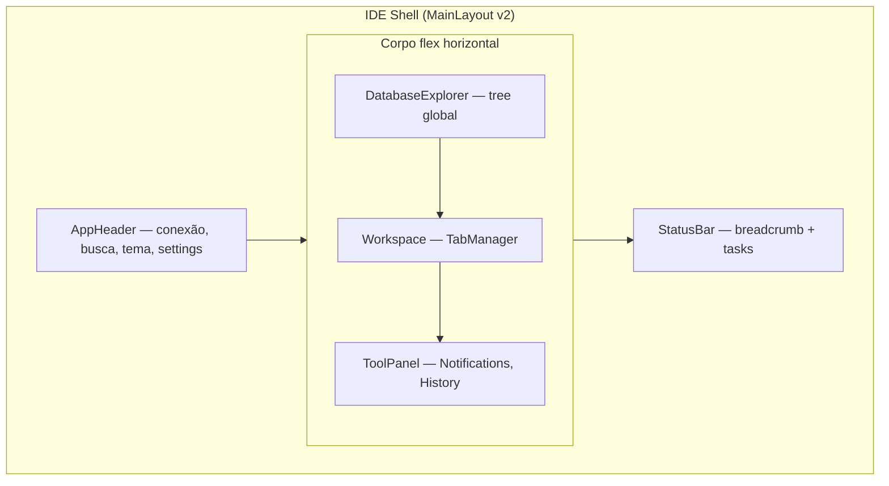
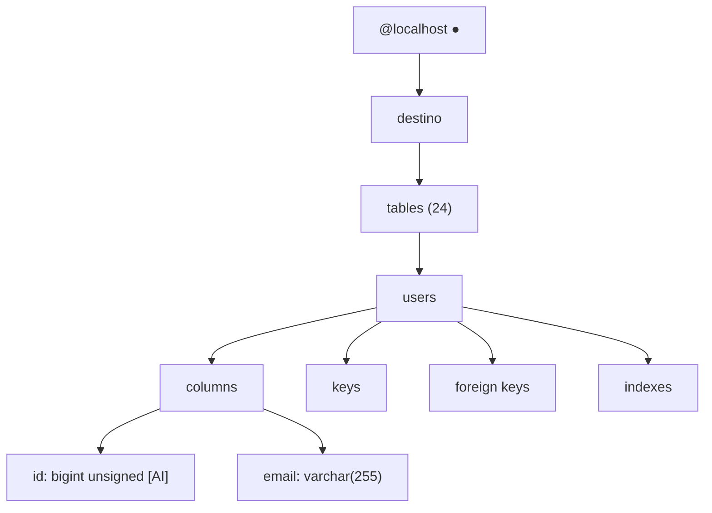

# Feature Spec: DataGrip UX + Sistema de Temas (VS Code-style)

> **Status:** implemented
> **Created:** 2026-06-26
> **Updated:** 2026-06-26
> **Author:** AI-assisted
> **Depends on:** `modernize-ui-and-stack.md` (implemented), `sql-console-cursor-execution.md` (implemented)

---

## Problem

Elendra hoje parece **app web com sidebar de navegação** (Dashboard, SQL Console, Query Builder, Dump). DataGrip é um **IDE de banco**: explorer à esquerda, workspace com abas no centro, painéis auxiliares à direita, status bar embaixo, atalhos de teclado, tree hierárquica profunda.

O tema atual é **dark shadcn fixo** (`ThemeProvider` força `class="dark"`). Usuários querem escolher tema como no VS Code / terminal — Dark+, Darcula, Solarized, temas light clássicos, etc.

**Objetivo:** UX o mais próximo possível do DataGrip; UI visualmente distinta mas **100% themeável** via tokens.

---

## Princípio guia

| Camada | O que copiar do DataGrip | O que NÃO copiar |
|--------|--------------------------|------------------|
| **UX** | Layout IDE, tree, abas, toolbars, atalhos, fluxos | Cores JetBrains, tipografia Darcula, ícones proprietários |
| **UI** | — | Paleta fixa. Tudo via design tokens + presets de tema |

```
UX = comportamento + estrutura + fluxo
UI = cores + tipografia + densidade + ícones (derivados do tema ativo)
```

---

## Gap analysis — Hoje vs DataGrip

| Área | DataGrip | Elendra hoje | Gap |
|------|----------|--------------|-----|
| Shell | IDE 3 painéis + status bar | Nav sidebar + TopBar + páginas | **Alto** — modelo mental diferente |
| Explorer | Tree: conexão → DB → tables → colunas/keys/indexes | SchemaBrowser só na `/query`; Dashboard é cards | **Alto** — explorer não é global |
| Workspace | Abas unificadas (SQL + data grid da mesma tabela) | SQL Console separado; tabela abre query via `?table=` | **Médio** |
| Data grid | WHERE/ORDER BY inline, CRUD toolbar, paginação, export CSV | ResultsPanel só leitura pós-query | **Alto** |
| Notificações | Painel direito timeline (sync, drivers, erros) | Sonner toast efêmero | **Médio** |
| Status bar | Breadcrumb `Database > @host > db > tables > users` | Só host/type no TopBar | **Alto** |
| Empty state | Atalhos centrados + drag-drop | Dashboard cards / query vazio | **Médio** |
| Temas | Darcula/New UI (fixo JetBrains) | Dark shadcn único | **Alto** — precisa multi-tema |

---

## Blueprint visual — Layout alvo (UX DataGrip)

### Vista geral

```
┌─────────────────────────────────────────────────────────────────────────────┐
│ TitleBar / AppHeader                                    [🔍] [⚙ tema] [👤] │
├──────────────┬──────────────────────────────────────────────┬───────────────┤
│              │  [console.sql ×] [users ×] [categories ×]  │               │
│  Database    ├──────────────────────────────────────────────┤ Notifications │
│  Explorer    │  Toolbar: ▶ Execute │ WHERE │ ORDER BY │ + - │  Timeline     │
│              ├──────────────────────────────────────────────┤               │
│  @localhost ●│                                              │  ✓ Sync OK    │
│  └ destino   │         Editor SQL  OU  Data Grid          │  ⚠ Driver     │
│    tables 24 │                                              │  ✕ Query err  │
│      users ◀ │                                              │               │
│        cols  │                                              │               │
│        keys  │                                              │               │
│              │                                              │               │
├──────────────┴──────────────────────────────────────────────┴───────────────┤
│ Database › @localhost › destino › tables › users          [tasks] [conn ●] │
└─────────────────────────────────────────────────────────────────────────────┘
```

### Mermaid — regiões do shell



### Mermaid — hierarquia do explorer (paridade DataGrip)



**Interações obrigatórias (UX):**

| Ação | Comportamento DataGrip | Elendra |
|------|------------------------|---------|
| Duplo-clique tabela | Abre aba data grid | Abre `TableDataTab` |
| Duplo-clique coluna | Insere nome no editor ativo | `onInsertText(col)` |
| Clique direito | Context menu (SELECT, DDL, refresh) | Fase 2 — menu contextual |
| Expandir tabela | Lazy-load columns/keys | `useColumns` + metadados futuros |
| Refresh explorer | Re-sync schema | `refetch` React Query |

---

## Workspace — sistema de abas unificado

Hoje: rotas (`/`, `/query`, …) + `queryStore` tabs só no SQL Console.

**Alvo:** um `workspaceStore` com abas tipadas:

```ts
type WorkspaceTab =
  | { id: string; kind: 'sql'; title: string; sql: string; database: string }
  | { id: string; kind: 'table-data'; title: string; table: string; database: string; where?: string; orderBy?: string }
  | { id: string; kind: 'welcome' }  // empty state com atalhos
```

### Empty state (welcome tab)

Centro da tela quando nenhuma aba aberta — inspirado DataGrip:

| Atalho | Ação Elendra |
|--------|--------------|
| `Ctrl+Shift+N` | Nova console SQL |
| `Ctrl+E` | Abas recentes |
| `Ctrl+Alt+S` | Gerenciar conexão / logout |
| `Ctrl+Shift+F` | Buscar em schema |
| Duplo `Shift` | Command palette (fase 3) |

Texto rodapé: *"Arraste arquivos .sql aqui para abrir"* (fase 3).

### Data grid tab (paridade screenshot users)

Toolbar acima da grid:

```
[WHERE ________] [ORDER BY ________]  |  [+] [-] [↑ commit]  |  [↻] [◀ ▶] [CSV ▾] [🔍]
```

- **WHERE / ORDER BY:** filtros ad-hoc → `GET /api/table/data?where=&orderBy=`
- **CRUD:** reutilizar rotas `POST/PATCH/DELETE /api/table/row`
- **Paginação:** offset/limit no footer (`1 row`, `100 rows`)
- **Export CSV:** fase 2 (spec futura `export-csv.md`)

---

## Rotas vs IDE — migração gradual

| Fase | Estratégia |
|------|------------|
| **1** | Novo shell IDE em `/` — explorer + workspace; rotas antigas redirecionam |
| **2** | Query Builder e Dump viram **tool windows** ou abas secundárias |
| **3** | Remover sidebar nav clássica; Dashboard vira opcional ou sumário no explorer |

**Fase 1 mantém** login em `/login` e APIs existentes — só reorganiza client.

---

## Sistema de temas — UI themeável (VS Code-style)

### Arquitetura

```
┌─────────────────────────────────────────┐
│ themeStore (Zustand + localStorage)     │
│   themeId: 'dark-plus' | 'darcula' | …  │
│   colorMode: 'dark' | 'light' | 'system'│
└──────────────┬──────────────────────────┘
               ▼
┌─────────────────────────────────────────┐
│ ThemeProvider v2                        │
│   aplica data-theme no <html>           │
│   injeta CSS vars do preset ativo       │
└──────────────┬──────────────────────────┘
               ▼
┌──────────────────┬──────────────────────┐
│ shadcn tokens    │ Monaco theme sync    │
│ bg-background…   │ defineTheme(preset)  │
└──────────────────┴──────────────────────┘
```

### Presets iniciais (MVP temas)

| ID | Tipo | Inspiração | Uso |
|----|------|------------|-----|
| `dark-plus` | dark | VS Code Dark+ | **default** |
| `darcula` | dark | JetBrains Darcula | favorito DBAs |
| `dracula` | dark | Dracula | popular dev |
| `one-dark` | dark | Atom One Dark | alternativa neutra |
| `solarized-dark` | dark | Solarized Dark | baixo contraste |
| `light-plus` | light | VS Code Light+ | escritório |
| `solarized-light` | light | Solarized Light | clássico |
| `github-light` | light | GitHub | clean |

Cada preset = objeto que mapeia **shadcn CSS vars** + **Monaco colors** + **syntax SQL**.

### Estrutura de arquivo

```
client/src/themes/
  index.ts              # registry + applyTheme()
  types.ts              # ThemePreset, ThemeColors
  presets/
    dark-plus.ts
    darcula.ts
    dracula.ts
    solarized-dark.ts
    solarized-light.ts
    light-plus.ts
    ...
  monaco/
    buildMonacoTheme.ts # preset → monaco.IStandaloneThemeData
```

### Token mapping (exemplo)

```ts
// presets/dark-plus.ts
export const darkPlus: ThemePreset = {
  id: 'dark-plus',
  label: 'Dark+',
  type: 'dark',
  colors: {
  '--background': '222.2 84% 4.9%',
  '--foreground': '210 40% 98%',
  '--sidebar': '222.2 47% 11%',      // explorer
  '--editor': '222.2 84% 4.9%',      // workspace
  '--status-bar': '222.2 47% 11%',
  '--tab-active': '217.2 32.6% 17.5%',
  '--tab-inactive': '222.2 47% 11%',
  '--tree-hover': '217.2 32.6% 17.5%',
  '--tree-selected': '217.2 91.2% 59.8% / 0.2',
  '--notification-info': '217.2 91.2% 59.8%',
  // ... shadcn: primary, muted, border, etc.
  },
  monaco: { base: 'vs-dark', rules: [...], colors: {...} },
};
```

### Tokens semânticos extras (além shadcn)

Para não hardcodar hex em componentes IDE:

| Token | Uso |
|-------|-----|
| `--sidebar` | Explorer, tool panels |
| `--editor` | Área SQL / grid |
| `--title-bar` | Header fino |
| `--status-bar` | Footer |
| `--tab-active` / `--tab-inactive` | Abas workspace |
| `--tree-selected` / `--tree-hover` | Explorer tree |
| `--grid-row-alt` | Linhas alternadas data grid |
| `--grid-header` | Cabeçalho colunas |

Componentes usam `bg-[hsl(var(--sidebar))]` ou classes utilitárias em `index.css`:

```css
.bg-sidebar { background-color: hsl(var(--sidebar)); }
```

### UI do seletor de tema

- **Onde:** AppHeader → ícone paleta / Settings dropdown
- **Opções:** lista presets agrupados Dark / Light + toggle System
- **Preview:** swatch 4 cores (bg, fg, accent, border)
- **Persistência:** `localStorage` key `elendra-theme`

### Monaco sync

`SqlEditor` escuta `themeStore` e chama `monaco.editor.setTheme(preset.monacoId)` — remove `elendra-dark` hardcoded.

---

## Componentes novos / refatorados

### Shell (Fase 1)

| Componente | Responsabilidade |
|------------|------------------|
| `layout/IdeShell.tsx` | Substitui `MainLayout` — grid IDE |
| `layout/AppHeader.tsx` | Conexão, ações globais, theme picker |
| `layout/StatusBar.tsx` | Breadcrumb + connection dot |
| `layout/ToolPanel.tsx` | Painel direito colapsável |
| `explorer/DatabaseExplorer.tsx` | Tree global (evolui `SchemaBrowser`) |
| `explorer/ExplorerToolbar.tsx` | +, refresh, collapse, filter |
| `workspace/TabBar.tsx` | Abas com close, drag reorder (fase 2) |
| `workspace/WorkspaceArea.tsx` | Render por `tab.kind` |
| `workspace/WelcomeTab.tsx` | Empty state + atalhos |
| `workspace/TableDataView.tsx` | Grid CRUD DataGrip-style |
| `notifications/NotificationPanel.tsx` | Timeline persistente |
| `theme/ThemePicker.tsx` | UI seleção preset |
| `stores/workspaceStore.ts` | Abas unificadas |
| `stores/themeStore.ts` | Tema ativo |
| `stores/notificationStore.ts` | Feed de eventos |

### Reuso

| Existente | Destino |
|-----------|---------|
| `SchemaBrowser.tsx` | Base de `DatabaseExplorer` — expandir hierarquia |
| `QueryConsole.tsx` | Lógica migra para `SqlTabView` dentro workspace |
| `SqlEditor.tsx` | Mantém; ganha sync de tema |
| `ResultsPanel.tsx` | Usado em SQL tab + pode embutir em table view |
| `split-pane.tsx` | Resize explorer / workspace / tools |

---

## Atalhos de teclado (UX DataGrip)

| Atalho | Ação |
|--------|------|
| `Ctrl+Enter` | Executar statement no cursor (já implementado) |
| `Ctrl+Shift+Enter` | Executar script inteiro |
| `Ctrl+Alt+L` | Format SQL |
| `Ctrl+W` | Fechar aba ativa |
| `Ctrl+Tab` | Próxima aba |
| `Ctrl+Shift+N` | Nova console |
| `Ctrl+E` | Recent tabs |
| `Ctrl+B` | Toggle explorer |
| `Ctrl+Shift+B` | Toggle notifications |
| `F5` | Refresh data grid / schema |

Registrar em `hooks/useIdeShortcuts.ts` — `preventDefault` só quando foco no workspace.

---

## Plano de implementação (fases)

### Fase 1 — Shell IDE + Temas MVP (2–3 sprints)

**Entrega:** app abre em layout DataGrip; 4 temas dark + 2 light; explorer global; abas SQL; status bar.

- [ ] `themeStore` + 6 presets + `ThemePicker`
- [ ] `IdeShell` substitui layout atual
- [ ] `DatabaseExplorer` com tree conexão → DB → tables → columns
- [ ] `workspaceStore` + `TabBar` + `SqlTabView` (migra QueryConsole)
- [ ] `StatusBar` com breadcrumb
- [ ] `WelcomeTab` empty state
- [ ] Monaco sync com tema ativo
- [ ] Redirect `/query` → `/` com aba SQL

### Fase 2 — Data grid + Notifications (1–2 sprints)

- [ ] `TableDataView` com WHERE/ORDER BY + CRUD
- [ ] Duplo-clique tabela abre grid tab
- [ ] `NotificationPanel` + `notificationStore` (sync, query errors, upload)
- [ ] Context menu no explorer (SELECT, abrir grid, copiar nome)

### Fase 3 — Polish IDE (1 sprint)

- [ ] Command palette (`Ctrl+Shift+P`)
- [ ] Drag reorder tabs
- [ ] Drop `.sql` file to open
- [ ] Query Builder / Dump como tool windows
- [ ] Temas restantes (dracula, one-dark, github-light)
- [ ] Remover nav sidebar legado

---

## API changes

### Fase 1

Nenhuma — reutiliza APIs existentes.

### Fase 2 (data grid)

Estender `GET /api/table/data`:

| Param | Tipo | Descrição |
|-------|------|-----------|
| `where` | string | Cláusula WHERE (validada/sanitizada server-side) |
| `orderBy` | string | ORDER BY |
| `limit` | number | default 100 |
| `offset` | number | paginação |

> **Segurança:** `where`/`orderBy` precisam whitelist ou parser — ver ADR futuro.

---

## Files affected (Fase 1)

```
client/src/index.css
client/src/main.tsx
client/src/App.tsx
client/src/themes/**
client/src/stores/themeStore.ts
client/src/stores/workspaceStore.ts
client/src/components/theme/ThemeProvider.tsx
client/src/components/theme/ThemePicker.tsx
client/src/components/layout/IdeShell.tsx
client/src/components/layout/AppHeader.tsx
client/src/components/layout/StatusBar.tsx
client/src/components/layout/ToolPanel.tsx
client/src/components/explorer/DatabaseExplorer.tsx
client/src/components/explorer/ExplorerToolbar.tsx
client/src/components/workspace/**
client/src/components/query/SqlEditor.tsx
client/src/components/query/QueryConsole.tsx  # deprecar → SqlTabView
client/src/hooks/useIdeShortcuts.ts
docs/specs/features/datagrip-ux-and-theme-system.md
docs/memory/STATE.md
docs/memory/PATTERNS.md
docs/memory/DECISIONS.md
```

---

## Acceptance criteria

### Fase 1

- [x] Layout 3 painéis + status bar visível em `/` após login
- [x] Explorer mostra: conexão → database ativo → tables → columns expandíveis
- [x] Workspace suporta múltiplas abas SQL com close/switch
- [x] Welcome tab exibe atalhos quando sem abas
- [x] Status bar mostra breadcrumb do item selecionado no explorer
- [x] Mínimo 6 presets de tema selecionáveis; escolha persiste após reload
- [x] Monaco editor muda cores ao trocar tema
- [x] Zero cores hex em novos componentes layout/explorer/workspace — só tokens
- [x] `npm run build` client passa

### Fase 2

- [x] Duplo-clique tabela abre aba data grid com dados reais
- [x] Toolbar WHERE/ORDER BY filtra grid
- [x] Notification panel lista últimos 50 eventos (query, sync, upload)
- [x] CRUD inline na grid (add/delete row + commit)

### Fase 3

- [x] Command palette funcional
- [x] Sidebar nav antiga removida
- [x] 8+ presets dark/light disponíveis

---

## Decisões propostas (ADR)

| # | Decisão | Razão |
|---|---------|-------|
| D1 | UX DataGrip, UI própria via tokens | Evita cópia visual JetBrains; permite temas VS Code |
| D2 | `data-theme` attribute + CSS vars | Compatível shadcn; fácil adicionar presets |
| D3 | Rotas → workspace tabs | Paridade IDE; uma superfície de trabalho |
| D4 | Sonner + Notification panel | Toast para feedback imediato; panel para histórico |
| D5 | Fase 1 sem mudança API | Menor risco; valida shell antes de CRUD grid |

---

## Wireframes ASCII — Estados

### Estado vazio (sem conexão / sem DB)

```
┌─ Database Explorer ─────────┐
│  Create data source...      │
│  (link → /login)            │
└─────────────────────────────┘

         Manage connection  Ctrl+Alt+S
         New SQL console    Ctrl+Shift+N
         ...
```

### SQL tab ativa

```
┌─ [console.sql ×] [users ×] ─────────────────────────────┐
│ ▶ Execute  Format  History ▾                             │
├──────────────────────────────────────────────────────────┤
│  1 ▶  SELECT * FROM users LIMIT 100;                    │
│  2     SELECT COUNT(*) FROM orders;                      │
├──────────────────────────────────────────────────────────┤
│  Results — 100 rows · 42ms                               │
│  ┌────┬──────────┬─────────────────┐                    │
│  │ id │ name     │ email           │                    │
│  └────┴──────────┴─────────────────┘                    │
└──────────────────────────────────────────────────────────┘
```

### Table data tab

```
┌─ [users ×] ──────────────────────────────────────────────┐
│ WHERE [id > 0        ] ORDER BY [id DESC    ]            │
│ [+] [-] [↑] [↻]  ◀ 1 / 5 ▶  Export [CSV ▾]              │
├──────┬──────────┬──────────────────────┬─────────────────┤
│  id  │ name     │ email                │ password        │
├──────┼──────────┼──────────────────────┼─────────────────┤
│  1   │ Admin    │ admin@example.com    │ ••••••          │
└──────┴──────────┴──────────────────────┴─────────────────┘
│ 1 row selected                              1 row total  │
└──────────────────────────────────────────────────────────┘
```

---

## Fora de escopo

- Copiar pixel-perfect visual JetBrains (fontes, ícones, animações)
- Temas customizados pelo usuário (JSON import estilo VS Code) — futuro
- Multi-conexão simultânea no explorer — futuro
- Diagrama ER — futuro
- Plugin system — futuro

---

## Dependencies

- **Requires:** `modernize-ui-and-stack.md`, `sql-console-cursor-execution.md`
- **Blocks:** export CSV spec, CRUD avançado, command palette spec
- **Related:** `modernize-server-architecture.md` (validação WHERE server-side)

---

## Próximo passo

1. Revisar este spec — ajustar escopo de fases se necessário
2. Marcar status → `approved`
3. Implementar **Fase 1** (shell + temas + explorer + abas SQL)

---

## Referências visuais

Screenshots DataGrip fornecidos pelo usuário (2026-06-26) — layout New UI:
- Explorer vazio com "Create data source"
- Tree expandida até columns/keys/indexes
- Data grid `users` com WHERE/ORDER BY e toolbar CRUD
- Notification timeline à direita
- Status bar com breadcrumb
